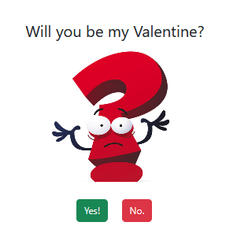

# HolidayHoots

Welcome to **HolidayHoots**! This is a fun and festive Django project designed to showcase frontend development skills with a holiday theme. Whether you're into Christmas, Halloween, or any other holiday, HolidayHoots has something for you!



## Getting Started

Follow these instructions to get a copy of the project up and running on your local machine.

### Prerequisites

- Python 3.10
- Django 5.x

### Installation

1. **Clone the repository:**

    ```bash
    git clone https://github.com/yourusername/HolidayHoots.git
    cd src
    ```

2. **Set up a virtual environment:**

    ```bash
    python3 -m venv venv
    source venv/bin/activate  # On Windows use `venv\Scripts\activate`
    ```

3. **Install the required Python packages:**

    ```bash
    pip install -r requirements.txt
    ```

4. **Run the development server:**

    ```bash
    python manage.py runserver
    ```

5. **Access the project:**

    Open your browser and navigate to `http://127.0.0.1:8000/` to see HolidayHoots in action!

## Project Structure

Here's a quick overview of the key directories and files in this project:

- `HolidayHoots/` - Main Django app directory
- `static/` - Contains all static files (CSS, JavaScript, images)
- `templates/` - HTML templates for different holiday themes
- `requirements.txt` - Lists all Python dependencies

## License

This project is licensed under the MIT License - see the [LICENSE](LICENSE) file for details.

## Acknowledgments
